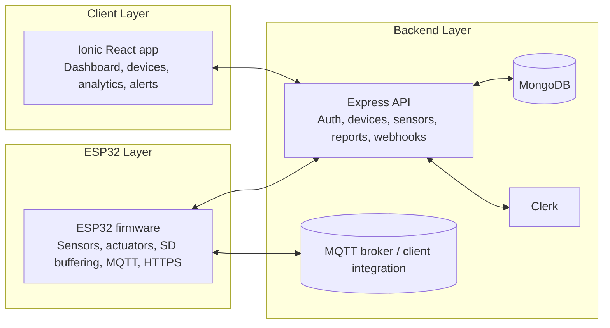

# BSFLY IoT

IoT-Based Environmental Control System for Black Soldier Fly Larvae Farming.

This repository contains three connected parts:

- A mobile/web frontend built with Ionic React, Capacitor, and Vite.
- A Node.js backend built with Express, MongoDB, MQTT, and Clerk authentication.
- ESP32 firmware that collects sensor data, controls actuators, and syncs with the backend.

## System Architecture



## Repository Structure

- `bsfly-iot/` - Ionic React frontend application.
- `server/` - Express backend and API routes.
- `esp32/` - Arduino/ESP32 firmware for environmental control.
- `README.md` - Project overview and setup guide.

## Frontend

The frontend lives in `bsfly-iot/` and uses:

- Ionic React for the UI shell and navigation.
- Capacitor for Android/mobile packaging.
- Clerk for authentication gating.
- Lazy-loaded feature pages such as dashboard, analytics, devices, light control, backup, and about.

Main entry points:

- `bsfly-iot/src/main.tsx`
- `bsfly-iot/src/App.tsx`

### Frontend Architecture

The app is organized around a small set of global providers and route-level pages:

- `LifeCycleProvider` manages app lifecycle behavior.
- `DeviceProvider` holds device and hardware state.
- `NotificationProvider` manages notification state and delivery.
- Routes switch between signed-in and signed-out experiences.
- Shared UI lives under `bsfly-iot/src/components/`.

## Backend

The backend lives in `server/` and exposes the API that powers the dashboard and device integrations.

Main entry point:

- `server/server.js`

### Backend Architecture

The server is structured as an Express app with layered responsibilities:

- `controllers/` exposes route handlers for users, devices, sensors, actuators, reports, and webhooks.
- `middleware/` handles auth, rate limiting, and validation.
- `database/` manages MongoDB connectivity.
- `models/` contains persistence models.
- `mqttClient.js` initializes MQTT connectivity and scheduler behavior.
- `webhooks/` contains Clerk webhook handling.

The backend flow is:

1. Accept authenticated HTTP requests from the Ionic app.
2. Receive device telemetry and control updates from the ESP32 layer.
3. Persist and query operational data in MongoDB.
4. Relay or reconcile real-time events through MQTT and webhooks.

## ESP32 Firmware

The firmware lives in `esp32/` and is responsible for local control even when the network is unavailable.

Main entry point:

- `esp32/main.ino`

### Firmware Responsibilities

- Read temperature, humidity, moisture, and ammonia sensors.
- Drive actuators such as fans, heater, humidifiers, pump, and enclosure light.
- Buffer data to SD card when offline.
- Publish telemetry through MQTT and send heartbeat/HTTPS requests.
- Continue autonomous control when the backend is temporarily unreachable.

## Tech Stack

- Frontend: Ionic React, React 19, TypeScript, Vite, Capacitor.
- Backend: Node.js, Express, MongoDB, MQTT, Clerk, dotenv.
- Firmware: Arduino C++ for ESP32.
- Testing: Vitest, Cypress, Node test runner.

## Getting Started

### Frontend

```bash
cd bsfly-iot
npm install
npm run dev
```

### Backend

```bash
cd server
npm install
npm run dev
```

### ESP32 Firmware

1. Open `esp32/main.ino` in the Arduino IDE or PlatformIO.
2. Create `esp32/credentials.h` from `esp32/credentials.h.example`.
3. Configure Wi-Fi, MQTT, API, and device credentials.
4. Flash the firmware to the ESP32 board.

## Notes

- The frontend uses signed-in and signed-out route guards.
- The backend allows local development origins such as `localhost:5173` and `localhost:8100`.
- The ESP32 firmware is designed to keep the incubator operating during network outages.

